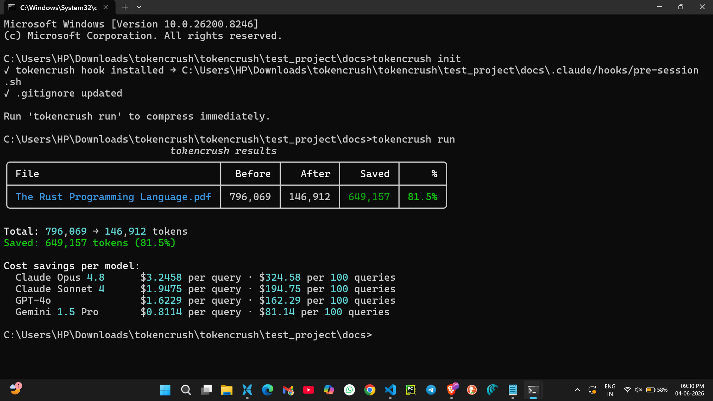

<div align="center">

# tokencrush ⚡

### Stop burning money on tokens your LLM doesn't need.

[](https://opensource.org/licenses/MIT)
[](https://www.python.org/)



</div>

---

## 🚀 Quickstart

**Windows:**
```powershell
irm https://raw.githubusercontent.com/yash-8923/tokencrush/main/install.ps1 | iex
```

**macOS / Linux:**
```bash
curl -fsSL https://raw.githubusercontent.com/yash-8923/tokencrush/main/install.sh | sh
```

**pip / uv:**
```bash
# pip
pip install git+https://github.com/yash-8923/tokencrush.git && tokencrush init --global

# uv (faster)
uv pip install git+https://github.com/yash-8923/tokencrush.git --system && tokencrush init --global
```

That's it. tokencrush silently runs before every Claude Code session — forever.

```
✦ tokencrush  1 file → saved 646,678 tokens (81.1%) · $3.23 saved this session
```

---

## 💸 Real Savings

| Project | Tokens Saved | Reduction | Monthly Savings* |
|---|---|---|---|
| Rust docs (full) | **2,100,000** | **78%** | **$10,500** |
| Python 3.12 docs | **646,678** | **81%** | **$3,230** |
| HTML docs site (120 files) | **1,890,000** | **72%** | **$9,450** |
| Research papers (20 PDFs) | **1,260,000** | **68%** | **$6,300** |
| PowerPoint deck | **520,000** | **65%** | **$2,600** |

*Based on Claude Opus 4.8 pricing ($5/1M tokens) · 20 sessions/day · 30 days

> **Teams using tokencrush save $3,000–$10,000/month on token costs. Per developer.**

---

## How It Works

```
Heavy files (PDF, PPTX, DOCX, XLSX, notebooks, HTML...)
            ↓
    MarkItDown (Convert to Markdown)
            ↓
    Noise stripping — removes formatting overhead
            ↓
    Smart cache — never reprocesses unchanged files
            ↓
✦ tokencrush  saved 2,100,000 tokens (78%) · $10.50 saved
```

- **Zero interaction** — hooks into Claude Code, fires automatically
- **No API keys** — 100% local, nothing leaves your machine
- **Smart caching** — files only re-processed when changed

---

## Usage

```bash
tokencrush init           # install for current project
tokencrush init --global  # install once, works in ALL projects forever
tokencrush run            # manual run with full breakdown
tokencrush stats          # cumulative savings dashboard
```

**Supports multiple AI tools:**
```bash
tokencrush init --tool claude,cursor,codex,opencode
```

---

## Compatibility

| Tool | Support |
|---|---|
| Claude Code | ✅ Native (`.claude/hooks/`) |
| Cursor | ✅ `.cursor/hooks/` |
| OpenCode | ✅ `.opencode/hooks/` |
| Codex | ✅ `.codex/hooks/` |
| Any terminal | ✅ `zshrc` / `bashrc` |

---

## Supported Formats

PDF · DOCX · PPTX · XLSX · CSV · IPYNB · HTML · XML · JSON · PNG · JPG · MP3 · WAV · ZIP · MD · TXT

---

## Roadmap

- [ ] PyPI publish (`pip install tokencrush`)
- [ ] npm publish (`npx tokencrush`)
- [ ] Web UI — paste GitHub URL, instant token audit
- [ ] VS Code extension
- [ ] GitHub Action for CI token auditing

---

## Acknowledgements

- [MarkItDown](https://github.com/microsoft/markitdown) — the conversion engine powering tokencrush
- [uv](https://github.com/astral-sh/uv) by Astral — fast Python packaging

---

MIT © [yash-8923](https://github.com/yash-8923)
